# BÁO CÁO PHÂN TÍCH & ĐỀ XUẤT CẢI TIẾN THIẾT KẾ CƠ SỞ DỮ LIỆU
*Hệ thống Gym Booking (Backend)*

Hệ thống cơ sở dữ liệu hiện tại được thiết kế trên nền tảng Django ORM tại file [models.py](file:///d:/DEHA/ThemLichTap_GYM/gym_booking_backend/infrastructure/models.py). Mặc dù cấu trúc cơ bản khá trực quan và tách biệt các thực thể chính xác, nhưng dưới góc độ phân tích thiết kế hệ thống chuyên nghiệp, database hiện tại đang tồn tại một số **điểm nghẽn thiết kế (design flaws)**, **dư thừa dữ liệu (data redundancy)**, **thiếu ràng buộc toàn vẹn** và **nguy cơ xảy ra race condition** khi số lượng giao dịch tăng cao. 

Dưới đây là phân tích chi tiết và các đề xuất cải tiến tối ưu nhất.

---

## 1. Phân tích chi tiết từng thực thể & Điểm cần cải thiện

### 1.1. Thực thể `Profile` (Hồ sơ người dùng)
- **Thiếu sót hiện tại**:
  - Thiếu thông tin liên hệ khẩn cấp (`emergency_contact_name`, `emergency_contact_phone`). Đối với lĩnh vực thể thao/gym, học viên có nguy cơ chấn thương hoặc gặp các vấn đề sức khỏe đột xuất trong quá trình tập luyện.
  - Thiếu hồ sơ chỉ số sức khỏe của học viên (như chiều cao, cân nặng, mục tiêu tập luyện, tiền sử bệnh lý nền/tim mạch).
- **Khuyến nghị**:
  - Thêm các trường: `emergency_contact_name` (CharField), `emergency_contact_phone` (CharField), `health_notes` (TextField) và `fitness_goals` (TextField).

### 1.2. Thực thể `Trainer` (Huấn luyện viên)
- **Thiếu sót hiện tại**:
  - **Dư thừa dữ liệu (Data Redundancy)**: Thực thể `Trainer` liên kết `OneToOneField` với `User` nhưng lại tự định nghĩa các trường `name` (trùng với `Profile.full_name`), `email` (trùng với `User.email`), `phone` (trùng với `Profile.phone`), `image` (trùng với `Profile.avatar`). Điều này gây dư thừa dữ liệu và nguy cơ cao bị không đồng bộ thông tin (data inconsistency) khi thông tin tài khoản User thay đổi.
  - Thiếu thông tin quản lý chứng chỉ hành nghề (`certifications`). Khách hàng thường muốn xem bằng cấp chuyên môn của huấn luyện viên trước khi đặt lịch.
- **Khuyến nghị**:
  - Nếu `Trainer` luôn gắn liền với một tài khoản đăng nhập (`User`), hãy loại bỏ các trường trùng lặp và truy xuất chúng thông qua liên kết `user` hoặc `profile`.
  - Thêm trường `certifications` (TextField hoặc JSONField) để lưu thông tin bằng cấp, chứng chỉ chuyên môn.

### 1.3. Thực thể `Room` (Phòng tập)
- **Thiếu sót hiện tại**:
  - Chỉ có thông tin vị trí (`location`) và sức chứa (`capacity`). Một phòng tập thực tế thường có các trang thiết bị đặc thù (ví dụ: phòng Yoga cần thảm, phòng Spinning cần xe đạp, phòng Kickboxing cần bao cát). Việc thiếu metadata về thiết bị/tiện ích khiến hệ thống không thể kiểm tra xem phòng tập có đáp ứng được yêu cầu của lớp học hay không.
- **Khuyến nghị**:
  - Thêm trường `amenities` hoặc `equipment` (TextField hoặc ManyToManyField đến bảng `Equipment` độc lập) để lưu trữ danh sách trang thiết bị đi kèm phòng tập.

### 1.4. Thực thể `Category` (Danh mục lớp học)
- **Thiếu sót hiện tại**:
  - Bảng `Category` kế thừa trực tiếp từ `models.Model` thay vì `TimestampedModel`. Điều này làm mất đi khả năng kiểm toán dữ liệu (auditing) như thời điểm danh mục được tạo hoặc cập nhật lần cuối.
- **Khuyến nghị**:
  - Chuyển sang kế thừa từ `TimestampedModel` để đồng bộ cơ chế lưu vết thời gian.

### 1.5. Thực thể `GymClass` (Lớp học)
- **Thiếu sót hiện tại**:
  - **Lỗi thiết kế nghiêm trọng (Critical Design Flaw)**: Trường `trainer` đang được khóa ngoại (`ForeignKey`) trực tiếp vào thực thể `GymClass`.
    - *Hệ quả*: Một lớp học (ví dụ: "Yoga Basics") chỉ có thể do duy nhất một Trainer giảng dạy ở mọi khung giờ. Trong thực tế, lớp học chỉ là một "khung chương trình" (Class Template). Trainer A có thể dạy lớp Yoga Basics vào thứ Hai, còn Trainer B dạy lớp Yoga Basics vào thứ Sáu. Ràng buộc cứng này làm mất đi tính linh hoạt của khâu xếp lịch biểu.
- **Khuyến nghị**:
  - Loại bỏ trường `trainer` khỏi `GymClass` (hoặc chỉ giữ lại làm huấn luyện viên phụ trách chính/mặc định) và chuyển liên kết `trainer` xuống thực thể `ClassSchedule` (Lịch học chi tiết).

### 1.6. Thực thể `ClassSchedule` (Lịch học chi tiết)
- **Thiếu sót hiện tại**:
  - **Trùng lịch (Schedule Conflicts)**: Không có ràng buộc ở mức cơ sở dữ liệu để ngăn việc một huấn luyện viên (`trainer`) hoặc một phòng tập (`room`) bị xếp lịch trùng nhau vào cùng một khoảng thời gian (Overlap).
  - **Đặt chỗ vượt hạn mức (Overbooking do Race Condition)**: 
    - Trường `current_participants` lưu số lượng người hiện tại đăng ký. Trong code [booking_service.py](file:///d:/DEHA/ThemLichTap_GYM/gym_booking_backend/application/services/booking_service.py), việc tăng biến đếm này được thực hiện bằng cách đọc từ DB lên RAM, cộng 1 rồi save. 
    - Khi có nhiều người dùng đặt lịch đồng thời ở một mili-giây cuối cùng, hệ thống sẽ đọc trùng một giá trị cũ và lưu lại, dẫn đến tình trạng số học viên đặt chỗ thực tế vượt quá `max_participants`.
  - **Lập lịch định kỳ (Recurring schedules)**: Chưa hỗ trợ cấu hình lớp lặp lại hàng tuần/tháng, gây mất thời gian khi Admin phải nhập thủ công từng slot.
- **Khuyến nghị**:
  - Chuyển `trainer` vào `ClassSchedule` để linh hoạt thay ca.
  - Sử dụng cơ chế khóa bi quan (Pessimistic Locking) bằng cách dùng `select_for_update()` trong database transaction khi đọc và cập nhật số lượng chỗ của `ClassSchedule`.
  - Thiết kế thêm bảng `RecurringRule` (ví dụ: lưu thứ tự ngày trong tuần, tần suất lặp lại, ngày bắt đầu và kết thúc) để tự động hóa việc tạo hàng loạt các bản ghi `ClassSchedule`.

### 1.7. Thực thể `Booking` (Đăng ký lịch)
- **Thiếu sót hiện tại**:
  - Bảng `Booking` không kế thừa từ `TimestampedModel` nên thiếu trường auditing `updated_at`.
  - **Đặt lịch trùng lặp (Duplicate Bookings)**: Một học viên có thể đặt lịch nhiều lần cho cùng một buổi học (`ClassSchedule`) do thiếu ràng buộc duy nhất (`UniqueConstraint`) ở mức DB cho các booking đang kích hoạt.
  - **Thiếu Hàng đợi chờ (Waitlist)**: Lớp học đầy thì học viên chỉ có thể quay lại sau. Không có cơ chế xếp hàng chờ tự động đôn lên khi có người hủy lịch.
  - Thiếu trường lý do hủy lịch (`cancellation_reason`).
- **Khuyến nghị**:
  - Kế thừa từ `TimestampedModel` để lưu trữ đầy đủ `created_at` và `updated_at`.
  - Thêm ràng buộc duy nhất `unique_together = ('user', 'schedule')` cho các booking ở trạng thái kích hoạt (không phải CANCELLED).
  - Thêm trường `cancellation_reason` (TextField) và hỗ trợ trạng thái `WAITLIST` trong enum trạng thái đặt lịch.

### 1.8. Thực thể `MembershipPackage` & `UserMembership` (Gói thành viên)
- **Thiếu sót hiện tại**:
  - **Phân quyền gói tập**: Chưa hỗ trợ giới hạn lớp học theo gói thành viên. Ví dụ: Gói Standard chỉ được tập gym cơ bản, gói Premium mới được tham gia các lớp chuyên biệt (Yoga, Boxing). Hiện tại mọi gói tập đều có quyền đặt bất kỳ lớp nào.
  - **Đóng băng gói tập (Freeze Membership)**: Chưa có tính năng cho phép học viên tạm dừng kích hoạt gói khi đi công tác hoặc bị ốm.
  - Bảng `UserMembership` thiếu trường `updated_at`.
- **Khuyến nghị**:
  - Thêm liên kết Many-to-Many giữa `MembershipPackage` và `Category` (hoặc `GymClass`) để chỉ định các lớp học được phép truy cập.
  - Tạo bảng `MembershipFreeze` liên kết với `UserMembership` để quản lý các khoảng thời gian tạm dừng gói tập và tự động cộng dồn ngày gia hạn tương ứng.

### 1.9. Thực thể `Payment` (Thanh toán)
- **Thiếu sót hiện tại**:
  - **Ràng buộc quá chặt (Tight Coupling)**: Thực thể `Payment` liên kết trực tiếp tới `UserMembership` thông qua trường khóa ngoại `membership`. 
    - *Hệ quả*: Hệ thống chỉ cho phép thanh toán gói thành viên. Khi cần mở rộng các khoản thanh toán khác như mua nước uống, đồ ăn, thuê PT riêng (Personal Trainer), hoặc phí phạt hủy lịch muộn, cấu trúc bảng này sẽ hoàn toàn bị phá vỡ.
  - Thiếu lưu trữ logs payload phản hồi đầy đủ của cổng thanh toán trực tuyến (VNPay/MoMo/Stripe), gây khó khăn trong đối soát tài chính khi giao dịch lỗi.
- **Khuyến nghị**:
  - Tách rời liên kết trực tiếp bằng cách tạo thực thể trung gian `Invoice` (Hóa đơn) và `InvoiceItem`. `Payment` sẽ trỏ trực tiếp đến `Invoice`.
  - Thêm trường `payment_gateway_response` dạng `JSONField` để lưu toàn bộ dữ liệu phản hồi thô (raw payload response) từ cổng thanh toán.

### 1.10. Thực thể `Review` (Đánh giá)
- **Thiếu sót hiện tại**:
  - Học viên có thể gửi đánh giá cho bất kỳ lớp học hay huấn luyện viên nào mà không cần biết đã từng tham gia học hay chưa (Đánh giá spam).
  - Cho phép để trống cả hai trường `trainer` và `gym_class` cùng lúc (cả hai đều `null=True`).
- **Khuyến nghị**:
  - Thêm kiểm tra logic: Học viên chỉ được phép đánh giá huấn luyện viên/lớp học nếu tồn tại một bản ghi đặt lịch thành công (`Booking.status = COMPLETED`) của học viên đó với `ClassSchedule` tương ứng.
  - Thêm ràng buộc để đảm bảo ít nhất một trong hai trường `trainer` hoặc `gym_class` phải được khai báo.

---

## 2. Bản vẽ thiết kế Database cải tiến (Optimized Schema ERD)

Dưới đây là sơ đồ cơ sở dữ liệu sau khi đã cải tiến, tối ưu hóa các quan hệ để giải quyết triệt để các vấn đề nêu trên:

```mermaid
erDiagram
    User ||--o| Profile : "has"
    User ||--o{ UserMembership : "buys"
    User ||--o{ Booking : "makes"
    User ||--o{ Invoice : "has"
    User ||--o{ Review : "writes"

    Profile {
        int id PK
        int user_id FK
        string full_name
        string phone
        string gender
        date date_of_birth
        text address
        string avatar
        string role
        string emergency_contact_name
        string emergency_contact_phone
        text health_notes
        text fitness_goals
    }

    Trainer {
        int id PK
        int user_id FK "nullable, 1-1"
        text specialty
        int experience_years
        text bio
        text certifications
        string status
        datetime created_at
        datetime updated_at
    }

    Category {
        int id PK
        string name "unique"
        text description
        string image
        string status
        datetime created_at
        datetime updated_at
    }

    GymClass {
        int id PK
        int category_id FK
        string name
        text description
        string difficulty_level
        int duration_minutes
        string image
        string status
        datetime created_at
        datetime updated_at
    }

    Room {
        int id PK
        string name
        string location
        int capacity
        text amenities
        string status
        datetime created_at
        datetime updated_at
    }

    ClassSchedule {
        int id PK
        int gym_class_id FK
        int trainer_id FK "Chuyển từ GymClass sang Schedule"
        int room_id FK
        datetime start_time
        datetime end_time
        int max_participants
        int current_participants
        string status
        datetime created_at
        datetime updated_at
    }

    Booking {
        int id PK
        int user_id FK
        int schedule_id FK
        string booking_code "unique"
        string status "PENDING, CONFIRMED, CANCELLED, COMPLETED, NO_SHOW, WAITLIST"
        text note
        text cancellation_reason
        datetime booked_at
        datetime cancelled_at
        datetime updated_at
    }

    MembershipPackage {
        int id PK
        string name "unique"
        text description
        decimal price
        int duration_days
        int max_bookings_per_week
        boolean is_freezable
        int max_freeze_days
        string status
        datetime created_at
        datetime updated_at
    }

    UserMembership {
        int id PK
        int user_id FK
        int package_id FK
        date start_date
        date end_date
        string status
        datetime created_at
        datetime updated_at
    }

    MembershipFreeze {
        int id PK
        int user_membership_id FK
        date start_date
        date end_date
        int duration_days
        string reason
        datetime created_at
    }

    Invoice {
        int id PK
        int user_id FK
        string invoice_number "unique"
        decimal total_amount
        string status "UNPAID, PAID, CANCELLED"
        datetime created_at
        datetime updated_at
    }

    InvoiceItem {
        int id PK
        int invoice_id FK
        string item_type "MEMBERSHIP, CLASS_FEE, MERCHANDISE, PENALTY"
        int object_id "Generic relation ID"
        decimal amount
    }

    Payment {
        int id PK
        int user_id FK
        int invoice_id FK "Liên kết hóa đơn tổng"
        decimal amount
        string payment_method
        string status
        datetime paid_at
        string transaction_code "unique"
        json payment_gateway_response
        datetime created_at
        datetime updated_at
    }

    Review {
        int id PK
        int user_id FK
        int trainer_id FK "nullable"
        int gym_class_id FK "nullable"
        int booking_id FK "nullable, verify purchase"
        int rating
        text comment
        datetime created_at
    }
```



---

## 3. Các đề xuất tối ưu kỹ thuật nâng cao

### 3.1. Đánh Chỉ Mục (Indexing) tối ưu hóa truy vấn
Nhằm cải thiện tốc độ tải trang khi số lượng người dùng tăng, các cột thường xuyên dùng để lọc (`filter`), kết hợp (`join`) hoặc sắp xếp (`order_by`) cần được đánh chỉ mục trong cấu hình Django `Meta.indexes`:
- **`ClassSchedule`**: Đánh chỉ mục hỗn hợp trên cặp `(start_time, status)`.
- **`Booking`**: Chỉ mục trên `booking_code`, `status` và `booked_at`.
- **`UserMembership`**: Chỉ mục trên `status` và `end_date` để tối ưu các tác vụ quét tự động gia hạn hoặc khóa tài khoản hết hạn.
- **`Payment`**: Chỉ mục trên `transaction_code` và `status`.

### 3.2. Áp dụng Cơ chế Xóa mềm (Soft Delete)
Các thực thể đóng vai trò danh mục lõi như `Trainer`, `Room`, `GymClass`, `MembershipPackage` tuyệt đối không nên dùng xóa cứng vật lý (`models.CASCADE` hoặc xóa bản ghi trực tiếp khỏi DB) vì sẽ gây lỗi cascade diện rộng hoặc làm hỏng dữ liệu báo cáo tài chính/thống kê đặt lịch cũ.
- Nên thiết kế trường `is_deleted = models.BooleanField(default=False)` và viết lại `BaseManager` của Django để tự động ẩn các bản ghi này khỏi giao diện Admin, nhưng vẫn duy trì cấu trúc dữ liệu liên kết cũ nhằm mục đích báo cáo doanh thu và đối soát lịch sử.

### 3.3. Khắc phục lỗi Race Condition trong Booking bằng Khóa Bi Quan (Pessimistic Locking)
Tại file [booking_service.py](file:///d:/DEHA/ThemLichTap_GYM/gym_booking_backend/application/services/booking_service.py), để ngăn chặn việc overbooking khi lớp học gần đầy, chúng ta cần khóa dòng `ClassSchedule` bằng `select_for_update()` ngay khi bắt đầu tiến hành đặt chỗ trong transaction:

```python
# Tối ưu hóa hàm create_booking bằng cách lock bản ghi ClassSchedule
@transaction.atomic
def create_booking(user, schedule_id, note=""):
    # select_for_update() khóa hàng này trong DB cho đến khi Transaction kết thúc
    schedule = (
        ClassSchedule.objects.select_for_update()
        .select_related("gym_class", "gym_class__trainer", "room")
        .filter(id=schedule_id)
        .first()
    )
    if not schedule:
        raise InvalidScheduleException("Schedule not found.")

    # Các hàm validate diễn ra khi dữ liệu đã được lock an toàn
    booking_validator.validate_schedule_is_open(schedule)
    booking_validator.validate_schedule_not_full(schedule)
    booking_validator.validate_schedule_not_started(schedule)
    booking_validator.validate_user_has_active_membership(user)
    booking_validator.validate_user_not_duplicate_booking(user, schedule)
    booking_validator.validate_user_not_overlap_booking(user, schedule)
    booking_validator.validate_weekly_booking_limit(user, schedule)

    # Tạo bản ghi đặt chỗ
    booking = booking_repository.create_booking(user, schedule, _generate_booking_code(), note)
    
    # Cập nhật số học viên an toàn
    schedule.current_participants += 1
    if schedule.current_participants >= schedule.max_participants:
        schedule.status = ScheduleStatus.FULL
    schedule.save(update_fields=["current_participants", "status", "updated_at"])
    
    return booking
```

---
*Tài liệu phân tích và thiết kế hệ thống được thực hiện bởi chuyên gia Phân tích thiết kế hệ thống.*
