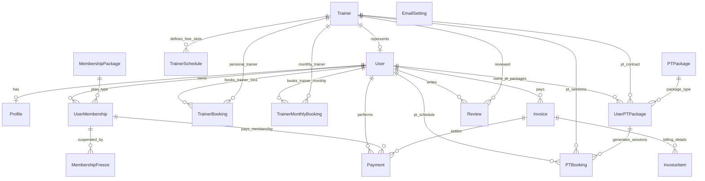

# TÀI LIỆU PHÂN TÍCH & CẤU TRÚC CƠ SỞ DỮ LIỆU DỰ ÁN GYM BOOKING

Tài liệu này cung cấp cái nhìn chi tiết về cấu trúc cơ sở dữ liệu hiện tại của dự án Gym Booking (được định nghĩa qua Django ORM tại [models.py](file:///d:/DEHA/DEHA/gym_booking_backend/infrastructure/models.py)).

---

## 1. Chi Tiết Các Bảng Dữ Liệu Hiện Tại (Current Database Schema)

Hệ thống bao gồm 17 thực thể (bảng dữ liệu) chính được phân nhóm theo nghiệp vụ:

### Nhóm 1: Người Dùng & Phân Quyền

#### 1. Bảng `Profile` (Hồ sơ chi tiết người dùng)
Mở rộng thông tin từ bảng `User` mặc định của Django để lưu thông tin hội viên, huấn luyện viên, quản trị viên.

| Tên trường | Kiểu dữ liệu | Ràng buộc / Khóa ngoại | Mô tả |
| :--- | :--- | :--- | :--- |
| `id` | BigAutoField | Primary Key | ID tự tăng |
| `user` | OneToOneField | `User` (on_delete=CASCADE) | Liên kết tài khoản Auth |
| `full_name` | CharField(150) | | Họ và tên đầy đủ |
| `phone` | CharField(20) | `blank=True` | Số điện thoại |
| `gender` | CharField(20) | `choices=GenderChoices` | Giới tính (nam/nữ/khác) |
| `date_of_birth`| DateField | `null=True, blank=True` | Ngày sinh |
| `address` | TextField | `blank=True` | Địa chỉ thường trú |
| `avatar` | ImageField | `upload_to="avatars/"` | Ảnh đại diện |
| `role` | CharField(20) | `choices=UserRole` (MEMBER/TRAINER/ADMIN) | Vai trò trong hệ thống |
| `emergency_contact_name`| CharField(150) | `blank=True` | Tên liên hệ khẩn cấp |
| `emergency_contact_phone`| CharField(20) | `blank=True` | SĐT liên hệ khẩn cấp |
| `health_notes` | TextField | `blank=True` | Lưu ý sức khỏe / Bệnh lý |
| `fitness_goals`| TextField | `blank=True` | Mục tiêu tập luyện |
| `created_at` | DateTimeField | `auto_now_add=True` | Thời điểm tạo hồ sơ |
| `updated_at` | DateTimeField | `auto_now=True` | Thời điểm cập nhật cuối |

---

### Nhóm 2: Huấn Luyện Viên & Cơ Sở Vật Chất

#### 2. Bảng `Trainer` (Huấn luyện viên)
Lưu thông tin riêng của các Huấn luyện viên (PT) bao gồm chuyên môn, giá tiền và bằng cấp.

| Tên trường | Kiểu dữ liệu | Ràng buộc / Khóa ngoại | Mô tả |
| :--- | :--- | :--- | :--- |
| `id` | BigAutoField | Primary Key | ID tự tăng |
| `user` | OneToOneField | `User` (on_delete=SET_NULL, nullable) | Liên kết tài khoản Auth |
| `name` | CharField(150) | | Tên hiển thị của HLV |

| `email` | EmailField | `unique=True` | Địa chỉ Email |
| `phone` | CharField(20) | | Số điện thoại liên hệ |
| `specialty` | CharField(100) | | Chuyên môn (ví dụ: Yoga, Boxing) |
| `experience_years`| PositiveIntegerField| `default=0` | Số năm kinh nghiệm |
| `bio` | TextField | `blank=True` | Giới thiệu bản thân |
| `certifications`| TextField | `blank=True` | Bằng cấp & Chứng chỉ chuyên môn |
| `session_price`| DecimalField | `max_digits=10, decimal_places=2` | Giá một buổi tập lẻ (1-1) |
| `image` | ImageField | `upload_to="trainers/"`, nullable | Ảnh chụp chân dung HLV |
| `status` | CharField(20) | `choices=CommonStatus` (active/inactive) | Trạng thái hoạt động |
| `created_at` | DateTimeField | `auto_now_add=True` | Thời điểm tạo |
| `updated_at` | DateTimeField | `auto_now=True` | Thời điểm cập nhật |

#### 3. Bảng `Room` (Phòng tập / Khu vực)
Nơi diễn ra các lớp tập nhóm hoặc tập cá nhân.

| Tên trường | Kiểu dữ liệu | Ràng buộc / Khóa ngoại | Mô tả |
| :--- | :--- | :--- | :--- |
| `id` | BigAutoField | Primary Key | ID tự tăng |
| `name` | CharField(100) | | Tên phòng (ví dụ: Studio A, Fight Zone) |
| `location` | CharField(255) | | Vị trí phòng (ví dụ: Tầng 2) |
| `capacity` | PositiveIntegerField| | Sức chứa tối đa (người) |
| `amenities` | TextField | `blank=True` | Tiện ích đi kèm (ví dụ: Thảm, Gương) |
| `status` | CharField(20) | `choices=RoomStatus` (active/maintenance)| Trạng thái phòng tập |
| `created_at` | DateTimeField | `auto_now_add=True` | Thời điểm tạo |
| `updated_at` | DateTimeField | `auto_now=True` | Thời điểm cập nhật |

---

### Nhóm 3: Đặt Lịch Huấn Luyện Viên Cá Nhân (1-1 PT)

#### 4. Bảng `TrainerBooking` (Đặt lịch lẻ 1-1 với HLV)
Đặt giờ tập riêng 1-1 theo buổi lẻ với huấn luyện viên cá nhân.

| Tên trường | Kiểu dữ liệu | Ràng buộc / Khóa ngoại | Mô tả |
| :--- | :--- | :--- | :--- |
| `id` | BigAutoField | Primary Key | ID tự tăng |
| `user` | ForeignKey | `User` (on_delete=CASCADE) | Học viên đặt lịch |
| `trainer` | ForeignKey | `Trainer` (on_delete=CASCADE) | Huấn luyện viên được thuê |
| `booking_code` | CharField(30) | `unique=True` | Mã đặt lịch lẻ |
| `start_time` | DateTimeField | | Thời gian bắt đầu buổi tập |
| `end_time` | DateTimeField | | Thời gian kết thúc |
| `status` | CharField(20) | `choices=BookingStatus` | Trạng thái đặt lịch |
| `note` | TextField | `blank=True` | Ghi chú của học viên |
| `cancellation_reason`| TextField| `blank=True` | Lý do hủy |
| `booked_at` | DateTimeField | `auto_now_add=True` | Thời điểm đặt |
| `cancelled_at` | DateTimeField | `null=True, blank=True` | Thời điểm hủy |
| `updated_at` | DateTimeField | `auto_now=True` | Thời điểm cập nhật |

#### 5. Bảng `TrainerMonthlyBooking` (Đăng ký HLV dài hạn theo tháng)
Đăng ký huấn luyện viên cá nhân theo gói tháng (chưa có lịch cụ thể từng buổi).

| Tên trường | Kiểu dữ liệu | Ràng buộc / Khóa ngoại | Mô tả |
| :--- | :--- | :--- | :--- |
| `id` | BigAutoField | Primary Key | ID tự tăng |
| `user` | ForeignKey | `User` (on_delete=CASCADE) | Học viên |
| `trainer` | ForeignKey | `Trainer` (on_delete=CASCADE) | Huấn luyện viên |
| `booking_code` | CharField(30) | `unique=True` | Mã đăng ký |
| `start_date` | DateField | | Ngày bắt đầu kích hoạt gói |
| `end_date` | DateField | | Ngày hết hạn |
| `months` | PositiveIntegerField| `default=1` | Số tháng đăng ký |
| `sessions_per_week`| PositiveIntegerField| `default=3` | Số buổi tập mỗi tuần |
| `preferred_time`| TimeField | `null=True, blank=True` | Khung giờ tập ưu tiên |
| `note` | TextField | `blank=True` | Ghi chú của học viên |
| `status` | CharField(20) | `choices=BookingStatus` | Trạng thái đăng ký |
| `cancellation_reason`| TextField| `blank=True` | Lý do hủy |
| `booked_at` | DateTimeField | `auto_now_add=True` | Thời điểm đăng ký |
| `cancelled_at` | DateTimeField | `null=True, blank=True` | Thời điểm hủy |
| `updated_at` | DateTimeField | `auto_now=True` | Thời điểm cập nhật |

---

### Nhóm 4: Thẻ Hội Viên & Gói Tập Gym

#### 6. Bảng `MembershipPackage` (Khung gói tập hội viên)
Định nghĩa các gói thành viên cơ bản như: Gói 1 tháng, Gói 6 tháng, Gói VIP...

| Tên trường | Kiểu dữ liệu | Ràng buộc / Khóa ngoại | Mô tả |
| :--- | :--- | :--- | :--- |
| `id` | BigAutoField | Primary Key | ID tự tăng |
| `name` | CharField(100) | `unique=True` | Tên gói tập (ví dụ: VIP 6 Months) |
| `description` | TextField | `blank=True` | Quyền lợi gói |
| `price` | DecimalField | `max_digits=10, decimal_places=2` | Giá bán gói tập |
| `duration_days`| PositiveIntegerField| | Thời gian hiệu lực (ngày) |
| `max_bookings_per_week`| PositiveIntegerField| `null=True, blank=True` | Giới hạn số buổi đặt lớp/tuần |
| `is_freezable` | BooleanField | `default=True` | Gói tập có cho phép bảo lưu không|
| `max_freeze_days`| PositiveIntegerField| `default=30` | Số ngày bảo lưu tối đa |
| `status` | CharField(20) | `choices=CommonStatus` | Trạng thái kích hoạt gói |
| `created_at` | DateTimeField | `auto_now_add=True` | Thời điểm tạo |
| `updated_at` | DateTimeField | `auto_now=True` | Thời điểm cập nhật |

#### 7. Bảng `UserMembership` (Thẻ hội viên của người dùng)
Theo dõi thẻ hội viên thực tế đang hoạt động của học viên.

| Tên trường | Kiểu dữ liệu | Ràng buộc / Khóa ngoại | Mô tả |
| :--- | :--- | :--- | :--- |
| `id` | BigAutoField | Primary Key | ID tự tăng |
| `user` | ForeignKey | `User` (on_delete=CASCADE) | Học viên sở hữu |
| `package` | ForeignKey | `MembershipPackage` (on_delete=PROTECT) | Đăng ký từ gói tập nào |
| `start_date` | DateField | | Ngày kích hoạt thẻ |
| `end_date` | DateField | | Ngày hết hạn thẻ |
| `status` | CharField(20) | `choices=MembershipStatus` (pending/active/expired/frozen/cancelled) | Trạng thái thẻ hội viên |
| `created_at` | DateTimeField | `auto_now_add=True` | Thời điểm mua |
| `updated_at` | DateTimeField | `auto_now=True` | Thời điểm cập nhật |

#### 8. Bảng `MembershipFreeze` (Lịch sử bảo lưu thẻ hội viên)
Lưu trữ thông tin chi tiết các lần tạm dừng/đóng băng thẻ của hội viên.

| Tên trường | Kiểu dữ liệu | Ràng buộc / Khóa ngoại | Mô tả |
| :--- | :--- | :--- | :--- |
| `id` | BigAutoField | Primary Key | ID tự tăng |
| `user_membership`| ForeignKey | `UserMembership` (on_delete=CASCADE) | Bảo lưu cho thẻ hội viên nào |
| `start_date` | DateField | | Ngày bắt đầu tạm dừng |
| `end_date` | DateField | | Ngày kết thúc tạm dừng |
| `duration_days`| PositiveIntegerField| | Số ngày tạm dừng thực tế |
| `reason` | TextField | `blank=True` | Lý do tạm dừng thẻ |
| `created_at` | DateTimeField | `auto_now_add=True` | Thời điểm tạo |
| `updated_at` | DateTimeField | `auto_now=True` | Thời điểm cập nhật |

---

### Nhóm 5: Gói Tập PT Chi Tiết (1-1 PT Schedule Generated)

#### 9. Bảng `PTPackage` (Gói tập với PT cá nhân)
Định nghĩa khung gói tập PT (ví dụ: Gói 12 buổi PT, Gói 24 buổi PT).

| Tên trường | Kiểu dữ liệu | Ràng buộc / Khóa ngoại | Mô tả |
| :--- | :--- | :--- | :--- |
| `id` | BigAutoField | Primary Key | ID tự tăng |
| `name` | CharField(100) | `unique=True` | Tên gói PT |
| `description` | TextField | `blank=True` | Mô tả gói |
| `price` | DecimalField | `max_digits=10, decimal_places=2` | Giá trọn gói |
| `duration_days`| PositiveIntegerField| | Hạn sử dụng gói (ngày) |
| `total_sessions`| PositiveIntegerField| | Tổng số buổi tập 1-1 |
| `is_active` | BooleanField | `default=True` | Có đang mở bán không |
| `created_at` | DateTimeField | `auto_now_add=True` | Thời điểm tạo |
| `updated_at` | DateTimeField | `auto_now=True` | Thời điểm cập nhật |

#### 10. Bảng `TrainerSchedule` (Khung thời gian rảnh của PT)
Cấu hình lịch rảnh định kỳ hàng tuần của PT để học viên đăng ký lớp.

| Tên trường | Kiểu dữ liệu | Ràng buộc / Khóa ngoại | Mô tả |
| :--- | :--- | :--- | :--- |
| `id` | BigAutoField | Primary Key | ID tự tăng |
| `trainer` | ForeignKey | `Trainer` (on_delete=CASCADE) | Huấn luyện viên |
| `weekday` | IntegerField | `choices=WeekdayChoices` (0=Thứ 2...6=Chủ nhật) | Ngày trong tuần |
| `start_time` | TimeField | | Giờ bắt đầu rảnh |
| `end_time` | TimeField | | Giờ kết thúc rảnh |
| `is_available` | BooleanField | `default=True` | Slot này có khả dụng không |
| `created_at` | DateTimeField | `auto_now_add=True` | Thời điểm tạo |
| `updated_at` | DateTimeField | `auto_now=True` | Thời điểm cập nhật |

#### 11. Bảng `UserPTPackage` (Đăng ký gói PT của người dùng)
Gói tập PT mà khách hàng đã thanh toán và cấu hình lịch tập cố định.

| Tên trường | Kiểu dữ liệu | Ràng buộc / Khóa ngoại | Mô tả |
| :--- | :--- | :--- | :--- |
| `id` | BigAutoField | Primary Key | ID tự tăng |
| `user` | ForeignKey | `User` (on_delete=CASCADE) | Học viên sở hữu |
| `trainer` | ForeignKey | `Trainer` (on_delete=PROTECT) | Huấn luyện viên được chọn |
| `package` | ForeignKey | `PTPackage` (on_delete=PROTECT) | Loại gói PT đã mua |
| `start_date` | DateField | | Ngày bắt đầu tập |
| `end_date` | DateField | | Ngày hết hạn gói |
| `total_sessions`| PositiveIntegerField| | Tổng số buổi tập |
| `used_sessions` | PositiveIntegerField| `default=0` | Số buổi đã tập thực tế |
| `remaining_sessions`| PositiveIntegerField| | Số buổi còn lại |
| `status` | CharField(20) | `choices=UserPTPackageStatus` (active/completed/cancelled) | Trạng thái gói PT |
| `selected_weekdays`| CharField(50) | Ví dụ: `'0,2,4'` (Thứ 2, 4, 6) | Các thứ cố định trong tuần |
| `start_time` | TimeField | | Khung giờ tập cố định |
| `end_time` | TimeField | | Khung giờ kết thúc cố định |
| `created_at` | DateTimeField | `auto_now_add=True` | Thời điểm tạo |
| `updated_at` | DateTimeField | `auto_now=True` | Thời điểm cập nhật |

#### 12. Bảng `PTBooking` (Lịch tập chi tiết của gói PT)
Hệ thống tự động sinh ra hàng loạt các buổi tập cụ thể dựa trên `UserPTPackage`.

| Tên trường | Kiểu dữ liệu | Ràng buộc / Khóa ngoại | Mô tả |
| :--- | :--- | :--- | :--- |
| `id` | BigAutoField | Primary Key | ID tự tăng |
| `user` | ForeignKey | `User` (on_delete=CASCADE) | Học viên |
| `trainer` | ForeignKey | `Trainer` (on_delete=CASCADE) | Huấn luyện viên |
| `user_pt_package`| ForeignKey | `UserPTPackage` (on_delete=CASCADE) | Thuộc gói PT nào đã mua |
| `booking_code` | CharField(30) | `unique=True` | Mã buổi tập |
| `booking_date` | DateField | | Ngày tập cụ thể |
| `start_time` | TimeField | | Giờ bắt đầu |
| `end_time` | TimeField | | Giờ kết thúc |
| `status` | CharField(20) | `choices=PTBookingStatus` (confirmed/completed/cancelled/pending) | Trạng thái buổi tập |
| `note` | TextField | `blank=True` | Ghi chú cụ thể |
| `created_at` | DateTimeField | `auto_now_add=True` | Thời điểm tạo |
| `updated_at` | DateTimeField | `auto_now=True` | Thời điểm cập nhật |

---

### Nhóm 6: Hóa Đơn, Thanh Toán & Đánh Giá

#### 13. Bảng `Invoice` (Hóa đơn)
Hóa đơn tổng cho các giao dịch đăng ký gói hội viên hoặc gói PT.

| Tên trường | Kiểu dữ liệu | Ràng buộc / Khóa ngoại | Mô tả |
| :--- | :--- | :--- | :--- |
| `id` | BigAutoField | Primary Key | ID tự tăng |
| `user` | ForeignKey | `User` (on_delete=CASCADE) | Người chịu thanh toán |
| `invoice_number`| CharField(50) | `unique=True` | Số hóa đơn (sinh ngẫu nhiên) |
| `total_amount` | DecimalField | `max_digits=10, decimal_places=2` | Tổng tiền hóa đơn |
| `status` | CharField(20) | `choices=InvoiceStatus` (paid/unpaid/cancelled) | Trạng thái hóa đơn |
| `created_at` | DateTimeField | `auto_now_add=True` | Thời điểm xuất hóa đơn |
| `updated_at` | DateTimeField | `auto_now=True` | Thời điểm cập nhật |

#### 14. Bảng `InvoiceItem` (Chi tiết mục hóa đơn)
Lưu chi tiết từng sản phẩm/dịch vụ có trong một hóa đơn tổng (Generic Relation).

| Tên trường | Kiểu dữ liệu | Ràng buộc / Khóa ngoại | Mô tả |
| :--- | :--- | :--- | :--- |
| `id` | BigAutoField | Primary Key | ID tự tăng |
| `invoice` | ForeignKey | `Invoice` (on_delete=CASCADE) | Thuộc hóa đơn nào |
| `item_type` | CharField(20) | `choices=InvoiceItemType` (membership/class_fee) | Loại dịch vụ |
| `object_id` | PositiveIntegerField| `null=True, blank=True` | ID tham chiếu tới thực thể dịch vụ |
| `amount` | DecimalField | `max_digits=10, decimal_places=2` | Số tiền của mục này |

#### 15. Bảng `Payment` (Thanh toán giao dịch)
Giao dịch thanh toán thực tế của khách hàng thông qua MoMo, VNPay hoặc Chuyển khoản ngân hàng.

| Tên trường | Kiểu dữ liệu | Ràng buộc / Khóa ngoại | Mô tả |
| :--- | :--- | :--- | :--- |
| `id` | BigAutoField | Primary Key | ID tự tăng |
| `user` | ForeignKey | `User` (on_delete=CASCADE) | Người thực hiện thanh toán |
| `membership` | ForeignKey | `UserMembership` (on_delete=CASCADE, nullable) | Thanh toán thẻ hội viên (nếu có)|
| `invoice` | ForeignKey | `Invoice` (on_delete=SET_NULL, nullable)| Hóa đơn được thanh toán |
| `amount` | DecimalField | `max_digits=10, decimal_places=2` | Số tiền giao dịch |
| `payment_method`| CharField(20) | `choices=PaymentMethod` (momo/vnpay/bank_transfer/cash) | Phương thức thanh toán |
| `status` | CharField(20) | `choices=PaymentStatus` (pending/success/failed) | Trạng thái thanh toán |
| `paid_at` | DateTimeField | `null=True, blank=True` | Giờ giao dịch thành công |
| `transaction_code`| CharField(100)| `unique=True`, nullable | Mã giao dịch từ đối tác |
| `payment_gateway_response`| JSONField | `null=True, blank=True` | Lưu log phản hồi từ cổng thanh toán|
| `created_at` | DateTimeField | `auto_now_add=True` | Thời điểm tạo giao dịch |
| `updated_at` | DateTimeField | `auto_now=True` | Thời điểm cập nhật |

#### 16. Bảng `Review` (Đánh giá & Phản hồi)
Ý kiến đánh giá và số sao của học viên dành cho huấn luyện viên hoặc lớp tập nhóm.

| Tên trường | Kiểu dữ liệu | Ràng buộc / Khóa ngoại | Mô tả |
| :--- | :--- | :--- | :--- |
| `id` | BigAutoField | Primary Key | ID tự tăng |
| `user` | ForeignKey | `User` (on_delete=CASCADE) | Học viên đánh giá |
| `trainer` | ForeignKey | `Trainer` (on_delete=CASCADE, nullable) | Huấn luyện viên được đánh giá |
| `rating` | PositiveSmallIntegerField| `choices=RatingChoices` (1 đến 5 sao) | Điểm đánh giá (1-5) |
| `comment` | TextField | `blank=True` | Bình luận/Nhận xét của học viên |
| `created_at` | DateTimeField | `auto_now_add=True` | Thời điểm đánh giá |

---

### Nhóm 7: Cấu hình Hệ thống

#### 17. Bảng `EmailSetting` (Cấu hình Email SMTP)
Model lưu trữ cấu hình máy chủ gửi thư SMTP động từ giao diện quản trị.

| Tên trường | Kiểu dữ liệu | Ràng buộc / Khóa ngoại | Mô tả |
| :--- | :--- | :--- | :--- |
| `id` | BigAutoField | Primary Key | ID tự tăng |
| `email_host` | CharField(255) | | SMTP Host (Ví dụ: `smtp.gmail.com`) |
| `email_port` | IntegerField | `default=587` | Cổng gửi SMTP (SMTP Port) |
| `email_host_user` | CharField(255) | | Địa chỉ tài khoản email dùng để gửi thư |
| `email_host_password` | CharField(255) | | Mật khẩu ứng dụng SMTP (App Password) |
| `email_use_tls` | BooleanField | `default=True` | Có sử dụng TLS bảo mật không |
| `is_active` | BooleanField | `default=False` | Kích hoạt cấu hình (chỉ 1 cấu hình active) |
| `created_at` | DateTimeField | `auto_now_add=True` | Thời điểm tạo cấu hình |
| `updated_at` | DateTimeField | `auto_now=True` | Thời điểm cập nhật cuối |

---

## 2. Sơ Đồ Quan Hệ Thực Thể Hiện Tại (Current Entity Relationship Diagram)

Dưới đây là sơ đồ Mermaid ERD mô tả các mối liên kết thực tế của 17 bảng dữ liệu hiện tại trong hệ thống Gym Booking:



---

## 3. Đánh Giá Chuyên Sâu Của Chuyên Gia CSDL (Expert Database Analysis)

> [!NOTE]
> Phần đánh giá này được viết từ góc nhìn của một **chuyên gia cơ sở dữ liệu (DBA Expert)**, phân tích toàn diện 7 khía cạnh: Tính toàn vẹn dữ liệu, Chuẩn hóa, Chỉ mục & Hiệu năng, Ràng buộc thiếu, Quan hệ & Thiết kế, Bảo mật dữ liệu, và Đề xuất cải thiện cụ thể.

---

### 3.1 ✅ Điểm Mạnh Của Schema Hiện Tại

1. **Phân lớp nghiệp vụ rõ ràng**: Hệ thống tách bạch 3 loại booking riêng biệt (`Booking`, `TrainerBooking`, `PTBooking`), mỗi loại có lifecycle và ràng buộc khác nhau. Đây là thiết kế tốt, tránh được bảng "God Table" chung.
2. **Quản lý hóa đơn theo Generic Relation**: `Invoice` + `InvoiceItem` tạo lớp trung gian giữa dịch vụ và thanh toán, cho phép mở rộng sang các dịch vụ mới (bán merchandise, thuê tủ đồ...) mà không cần thay đổi schema.
3. **Cơ chế chống Race Condition đã triển khai**: `booking_service.py` sử dụng `select_for_update()` kết hợp `@transaction.atomic` khi đặt lịch lớp nhóm — đây là best practice của Django ORM.
4. **Hỗ trợ Waitlist**: Khi lớp học đầy, hệ thống tự động tạo booking với trạng thái `WAITLIST` và tự promote khi có người hủy — logic queue xếp hàng chuyên nghiệp.
5. **Quy trình sinh lịch PT tự động**: `UserPTPackage` kết hợp `selected_weekdays` + `PTBooking` tự sinh lịch cố định hàng tuần, giảm thao tác thủ công.
6. **Sử dụng `TimestampedModel` nhất quán**: Đa số các model kế thừa `TimestampedModel` (có `created_at` + `updated_at`) — giúp truy vết và audit dữ liệu.

---

### 3.2 🔴 VẤN ĐỀ NGHIÊM TRỌNG (Critical Issues)

#### Vấn đề #1: Dữ liệu HLV bị trùng lặp nghiêm trọng (Data Redundancy — Vi phạm 3NF)

**Mức độ**: 🔴 Nghiêm trọng

Bảng `Trainer` tự định nghĩa lại `name`, `email`, `phone` độc lập với tài khoản `User` và `Profile` liên kết. Điều này dẫn đến:

| Vấn đề | Hệ quả |
|:---|:---|
| Dữ liệu bị "rẽ nhánh" | HLV đổi email trong tài khoản `User`, nhưng email ở bảng `Trainer` vẫn giữ giá trị cũ → hiển thị sai trên giao diện |
| Không thống nhất nguồn dữ liệu (Single Source of Truth) | Admin không biết nên tin bảng `User` hay bảng `Trainer` |
| Lãng phí bộ nhớ | Lưu trữ cùng 1 thông tin ở 2 nơi |

**Đề xuất khắc phục**:
```python
# Phương án 1: Xóa các trường trùng lặp, delegate về Profile
class Trainer(TimestampedModel):
    user = models.OneToOneField(User, on_delete=models.CASCADE)  # BẮT BUỘC liên kết
    specialty = models.CharField(max_length=100)
    experience_years = models.PositiveIntegerField(default=0)
    bio = models.TextField(blank=True)
    certifications = models.TextField(blank=True)
    session_price = models.DecimalField(max_digits=10, decimal_places=2)
    status = models.CharField(max_length=20, choices=CommonStatus.choices)
    # Lấy name, email, phone, image từ user.profile

# Phương án 2 (Tương thích ngược): Giữ nguyên nhưng thêm auto-sync
# Override save() hoặc dùng Django signal để đồng bộ từ Profile → Trainer
```

---

#### Vấn đề #2: `InvoiceItem.object_id` không có Foreign Key thực sự (Broken Generic Relation)

**Mức độ**: 🔴 Nghiêm trọng

```python
class InvoiceItem(models.Model):
    item_type = models.CharField(max_length=20, choices=InvoiceItemType.choices)
    object_id = models.PositiveIntegerField(null=True, blank=True)  # ⚠️ KHÔNG CÓ FK!
```

Trường `object_id` chỉ là một số nguyên trơn (`PositiveIntegerField`), **không** liên kết khóa ngoại tới bất kỳ bảng nào. Điều này gây ra:

| Vấn đề | Hệ quả |
|:---|:---|
| Không có ràng buộc tham chiếu (Referential Integrity) | Nếu xóa `UserMembership` id=5, `InvoiceItem(object_id=5)` vẫn tồn tại → dữ liệu "mồ côi" (orphaned data) |
| Không thể JOIN hiệu quả | Phải dùng logic code thủ công để tra cứu, không thể dùng `select_related()` |
| Dễ bị lỗi khi `item_type` không khớp | Trường `object_id=5` có thể tham chiếu tới `UserMembership` hoặc `TrainerBooking` tùy `item_type` — database không kiểm soát được |

**Đề xuất khắc phục**:
```python
# Phương án 1: Dùng Django ContentType Framework (Best Practice cho Generic Relation)
from django.contrib.contenttypes.fields import GenericForeignKey
from django.contrib.contenttypes.models import ContentType

class InvoiceItem(models.Model):
    invoice = models.ForeignKey(Invoice, on_delete=models.CASCADE, related_name="items")
    content_type = models.ForeignKey(ContentType, on_delete=models.CASCADE, null=True)
    object_id = models.PositiveIntegerField(null=True, blank=True)
    content_object = GenericForeignKey("content_type", "object_id")
    amount = models.DecimalField(max_digits=10, decimal_places=2)

# Phương án 2: Tách thành FK cụ thể (dễ hiểu hơn, JOIN nhanh hơn)
class InvoiceItem(models.Model):
    invoice = models.ForeignKey(Invoice, on_delete=models.CASCADE)
    membership = models.ForeignKey(UserMembership, null=True, blank=True, on_delete=models.SET_NULL)
    trainer_booking = models.ForeignKey(TrainerBooking, null=True, blank=True, on_delete=models.SET_NULL)
    amount = models.DecimalField(max_digits=10, decimal_places=2)
```

---

#### Vấn đề #3: `TrainerBooking` và `TrainerMonthlyBooking` không kế thừa `TimestampedModel`

**Mức độ**: 🟠 Trung bình

```python
class TrainerBooking(models.Model):  # ⚠️ Tương tự
class TrainerMonthlyBooking(models.Model):  # ⚠️ Tương tự
```

Các bảng booking tự khai báo `booked_at` + `updated_at` riêng thay vì dùng `created_at` + `updated_at` từ `TimestampedModel`. Điều này tạo ra:
- **Tên trường không nhất quán**: Một số bảng dùng `created_at`, một số dùng `booked_at`.
- **Khó viết query chung**: Không thể viết một filter chung cho tất cả model theo `created_at`.

**Đề xuất**: Kế thừa `TimestampedModel` và alias `booked_at` thành property nếu cần:
```python
class Booking(TimestampedModel):
    @property
    def booked_at(self):
        return self.created_at
```

---

#### Vấn đề #4: `UserPTPackage.selected_weekdays` lưu dạng chuỗi thay vì quan hệ

**Mức độ**: 🟠 Trung bình

```python
selected_weekdays = models.CharField(max_length=50, help_text="Danh sách thứ tự chọn (ví dụ: '0,2,4')")
```

Lưu dạng CSV string (`"0,2,4"`) vi phạm **Quy tắc chuẩn hóa 1NF** (mỗi ô chỉ chứa 1 giá trị nguyên tử). Hệ quả:
- **Không thể query hiệu quả**: `WHERE selected_weekdays LIKE '%2%'` sẽ match cả `"12"` (sai).
- **Không thể dùng database index**: Bắt buộc full table scan.
- **Phải parse bằng code Python**: Chuyển đổi `"0,2,4"` → `[0, 2, 4]` thủ công mỗi lần dùng.

**Đề xuất khắc phục**:
```python
# Phương án 1: Dùng JSONField (PostgreSQL hỗ trợ indexing cho JSONField)
selected_weekdays = models.JSONField(default=list, help_text="Ví dụ: [0, 2, 4]")

# Phương án 2: Dùng ManyToManyField nếu cần query phức tạp
# Tạo bảng trung gian UserPTPackageWeekday
```

---

### 3.3 🟡 VẤN ĐỀ THIẾU CHỈ MỤC & RÀNG BUỘC (Missing Indexes & Constraints)

#### Vấn đề #5: Thiếu database index cho các trường hay được query

Các trường thường xuyên xuất hiện trong `WHERE`, `ORDER BY`, `JOIN` nhưng **chưa có index**:

| Bảng | Trường cần index | Lý do |
|:---|:---|:---|
| `TrainerBooking` | `trainer_id, status` | HLV xem lịch cá nhân |
| `TrainerBooking` | `start_time` | Sắp xếp theo giờ, kiểm tra trùng lặp |
| `Payment` | `status` | Dashboard thống kê doanh thu |
| `Payment` | `invoice_id` | JOIN Payment → Invoice |
| `Invoice` | `status` | Filter hóa đơn chưa thanh toán |
| `UserMembership` | `user_id, status` (composite) | Kiểm tra membership active |
| `PTBooking` | `booking_date` | Xem lịch tập theo ngày |
| `Review` | `trainer_id` | Tính rating trung bình của HLV |
| `InvoiceItem` | `item_type, object_id` (composite) | Tra cứu item theo loại và ID tham chiếu |

**Đề xuất**:
```python
class Meta:
    indexes = [
        models.Index(fields=["status"]),
        models.Index(fields=["user", "status"]),
        # ...
    ]
```

---

#### Vấn đề #6: Thiếu ràng buộc CHECK tại cấp database

Nhiều quy tắc nghiệp vụ chỉ được kiểm tra ở **tầng Python** (service/validator) mà **không có ở tầng database**. Nếu ai đó insert trực tiếp qua Django Admin hoặc SQL shell, các quy tắc sẽ bị bypass:

| Quy tắc cần CHECK constraint | Bảng | Trạng thái hiện tại |
|:---|:---|:---|
| `start_date < end_date` | `TrainerMonthlyBooking`, `UserPTPackage`, `MembershipFreeze` | ⚠️ Chỉ validate ở service |
| `remaining_sessions = total_sessions - used_sessions` | `UserPTPackage` | ⚠️ Computed thủ công |
| `rating BETWEEN 1 AND 5` | `Review` | ✅ Có validator nhưng chưa có CHECK DB |

**Đề xuất**:
```python
class Meta:
    constraints = [
        models.CheckConstraint(
            check=models.Q(start_time__lt=models.F("end_time")),
            name="check_schedule_start_before_end"
        ),
            ]
```

---

#### Vấn đề #7: Thiếu UniqueConstraint quan trọng

| Bảng | Ràng buộc cần thêm | Lý do |
|:---|:---|:---|
| `Review` | `(user, trainer)` hoặc `(user, gym_class)` khi chưa có booking tham chiếu | Tránh user đánh giá cùng 1 trainer nhiều lần |
| `MembershipFreeze` | Kiểm tra khoảng thời gian freeze không chồng lấn | Tránh freeze 2 lần cùng thời điểm |
| `UserPTPackage` | `(user, trainer, status=active)` | Tránh user mua 2 gói PT active với cùng 1 trainer |
| `InvoiceItem` | `(item_type, object_id)` | 1 đối tượng chỉ nên có 1 invoice item |

---

### 3.4 🟡 VẤN ĐỀ VỀ MỐI QUAN HỆ (Relationship Issues)

#### Vấn đề #8: `Trainer.user` cho phép `SET_NULL` — Rủi ro HLV mất liên kết tài khoản

```python
user = models.OneToOneField(User, on_delete=models.SET_NULL, null=True, blank=True)
```

Nếu Admin xóa tài khoản `User` của HLV, trường `user` bị đặt thành `NULL` → HLV **không thể đăng nhập** nhưng vẫn tồn tại trong hệ thống, vẫn có thể được đặt lịch. Đây là trạng thái "zombie" nguy hiểm.

**Đề xuất**: Chuyển sang `on_delete=models.PROTECT` để ngăn xóa User khi HLV còn liên kết, hoặc override `delete()` để tự động deactivate Trainer trước.

---

#### Vấn đề #9: `TrainerBooking` và `TrainerMonthlyBooking` dùng `on_delete=CASCADE` cho Trainer

```python
trainer = models.ForeignKey(Trainer, on_delete=models.CASCADE)
```

Nếu xóa 1 Trainer → **toàn bộ lịch sử đặt lịch cá nhân bị xóa** → mất dữ liệu kinh doanh và tài chính. Trong khi đó, bảng `UserPTPackage` lại dùng `PROTECT` (đúng). Không nhất quán.

**Đề xuất**: Thay `CASCADE` bằng `PROTECT` hoặc `SET_NULL` cho các bảng chứa dữ liệu lịch sử.

---

### 3.5 🟡 VẤN ĐỀ BẢO MẬT DỮ LIỆU (Data Security Issues)

#### Vấn đề #10: `TrainerSerializer` expose toàn bộ trường với `fields = "__all__"`

```python
class TrainerSerializer(serializers.ModelSerializer):
    class Meta:
        model = Trainer
        fields = "__all__"  # ⚠️ Expose cả user_id, email, phone ra API public
```

Điều này có nghĩa bất kỳ ai gọi API `/api/trainers/` đều nhận được **email cá nhân**, **số điện thoại**, và **user_id** của HLV. Tương tự cho `MembershipPackageSerializer`, `MembershipFreezeSerializer`.

**Đề xuất**: Khai báo fields cụ thể, loại bỏ các trường nhạy cảm:
```python
class TrainerSerializer(serializers.ModelSerializer):
    class Meta:
        model = Trainer
        fields = ("id", "name", "specialty", "experience_years", "bio",
                  "certifications", "session_price", "image", "status")
        # KHÔNG expose: user, email, phone
```

---

#### Vấn đề #11: Thiếu Soft Delete — Xóa dữ liệu là vĩnh viễn

Hiện tại không có cơ chế **soft delete** (đánh dấu `is_deleted=True` thay vì `DELETE FROM`). Nếu Admin nhấn xóa 1 `Trainer`, `Room`, hoặc `Category` qua Django Admin, dữ liệu liên quan bị mất vĩnh viễn (hoặc bị chặn bởi `PROTECT`).

**Đề xuất**: Thêm trường `is_deleted` và custom Manager:
```python
class SoftDeleteModel(TimestampedModel):
    is_deleted = models.BooleanField(default=False)
    deleted_at = models.DateTimeField(null=True, blank=True)

    class Meta:
        abstract = True

    def soft_delete(self):
        self.is_deleted = True
        self.deleted_at = timezone.now()
        self.save(update_fields=["is_deleted", "deleted_at"])
```

---

### 3.6 🟡 VẤN ĐỀ HIỆU NĂNG (Performance Issues)

#### Vấn đề #12: `UserPTPackage.remaining_sessions` là trường dư thừa (Redundant Computed Field)

```python
total_sessions = models.PositiveIntegerField()
used_sessions = models.PositiveIntegerField(default=0)
remaining_sessions = models.PositiveIntegerField()  # = total_sessions - used_sessions
```

`remaining_sessions` luôn bằng `total_sessions - used_sessions`. Lưu trữ giá trị computed tạo nguy cơ:
- **Dữ liệu bị lệch**: Nếu cập nhật `used_sessions` mà quên cập nhật `remaining_sessions`.
- **Vi phạm nguyên tắc DRY** (Don't Repeat Yourself).

**Đề xuất**: Chuyển thành `@property` hoặc annotation:
```python
@property
def remaining_sessions(self):
    return max(self.total_sessions - self.used_sessions, 0)
```

---

### 3.7 📋 BẢNG TỔNG HỢP ĐỀ XUẤT CẢI THIỆN (Improvement Roadmap)

| # | Vấn đề | Mức độ | Loại | Hành động cần làm | Ưu tiên |
|:--|:---|:--|:--|:---|:--|
| 1 | Trainer trùng lặp dữ liệu với User/Profile | 🔴 | Normalization | Refactor Trainer → delegate thông tin về Profile | P0 |
| 2 | InvoiceItem.object_id không có FK | 🔴 | Integrity | Dùng ContentType hoặc FK cụ thể | P0 |
| 3 | TrainerBooking models không dùng TimestampedModel | 🟠 | Consistency | Kế thừa TimestampedModel | P1 |
| 4 | selected_weekdays lưu CSV string | 🟠 | 1NF Violation | Chuyển sang JSONField | P1 |
| 5 | Thiếu database index | 🟡 | Performance | Thêm index cho 12+ trường | P1 |
| 6 | Thiếu CHECK constraint | 🟡 | Integrity | Thêm 6+ CHECK constraints | P1 |
| 7 | Thiếu UniqueConstraint | 🟡 | Integrity | Thêm 4+ unique constraints | P1 |
| 8 | Trainer.user dùng SET_NULL | 🟡 | Design | Chuyển sang PROTECT | P2 |
| 9 | Trainer booking dùng CASCADE | 🟡 | Data Loss | Chuyển sang PROTECT/SET_NULL | P1 |
| 10 | Serializer expose sensitive data | 🟡 | Security | Khai báo fields cụ thể | P0 |
| 11 | Thiếu Soft Delete | 🟡 | Data Safety | Thêm SoftDeleteModel abstract | P2 |
| 12 | remaining_sessions là computed field dư | 🟡 | DRY | Chuyển thành @property | P2 |

---

### 3.8 📊 ĐÁNH GIÁ TỔNG THỂ (Overall Assessment)

```
┌──────────────────────────────────────────────────┐
│           ĐIỂM ĐÁNH GIÁ TỔNG THỂ                │
│                                                  │
│   Thiết kế Schema      : ★★★★☆  (4/5)           │
│   Tính toàn vẹn dữ liệu: ★★★☆☆  (3/5)          │
│   Hiệu năng & Index    : ★★☆☆☆  (2/5)          │
│   Bảo mật dữ liệu      : ★★★☆☆  (3/5)          │
│   Chuẩn hóa (NF)       : ★★★☆☆  (3/5)          │
│   Tổng thể             : ★★★☆☆  (3/5)          │
│                                                  │
│   ⚡ Ưu tiên #1: Thêm Index & CHECK constraints │
│   ⚡ Ưu tiên #2: Fix InvoiceItem Generic Relation│
│   ⚡ Ưu tiên #3: Refactor Trainer data model     │
└──────────────────────────────────────────────────┘
```

**Kết luận**: Schema hiện tại có nền tảng thiết kế tốt (phân lớp rõ ràng, hỗ trợ waitlist, có transaction locking), nhưng cần bổ sung đáng kể về **indexing**, **CHECK constraints**, và **data integrity** tại cấp database để sẵn sàng cho production. Các vấn đề normalization (trùng lặp Trainer info, CSV string trong column) cần được xử lý trước khi scale lên.