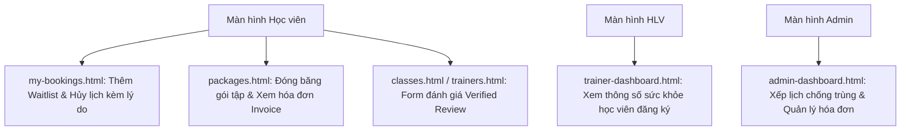

# HƯỚNG DẪN CẢI TIẾN FRONTEND THEO CẤU TRÚC BACKEND MỚI
*Dự án Hệ thống Gym Booking*

Tài liệu này hướng dẫn cách nâng cấp các trang giao diện (HTML/JS) hiện tại của thư mục [gym_booking_frontend](file:///d:/DEHA/ThemLichTap_GYM/gym_booking_frontend) để tích hợp và khai thác tối đa các API nâng cấp từ phía Backend (bao gồm Hồ sơ sức khỏe, Lập lịch linh hoạt, Hàng đợi danh sách chờ, Đóng băng gói tập, Hóa đơn và Đánh giá xác thực).

---

## 1. Tổng quan các màn hình Frontend cần nâng cấp

Hiện tại, Frontend của hệ thống là ứng dụng Web dạng Single Page hoặc Multi Page sử dụng mã HTML thuần và Javascript. Chúng ta cần cập nhật các tệp giao diện chính sau:

---

## 2. Chi tiết nâng cấp cho từng trang Giao diện

### 2.1. Cập nhật Hồ sơ học viên & Đăng ký tài khoản
* **Tệp cần sửa**: `register.html` và các phần cập nhật hồ sơ cá nhân.
* **Thay đổi chi tiết**:
  - Bổ sung thêm các trường nhập liệu trong Form Hồ sơ:
    * **Tên liên hệ khẩn cấp** (`emergency_contact_name`)
    * **SĐT liên hệ khẩn cấp** (`emergency_contact_phone`)
    * **Lưu ý sức khỏe** (`health_notes`, ví dụ: bệnh tim mạch, chấn thương cột sống...)
    * **Mục tiêu luyện tập** (`fitness_goals`, ví dụ: giảm mỡ, tăng cơ...)
  - **API tích hợp**: Gửi payload chứa các trường này lên endpoint [ProfileMeAPIView](file:///d:/DEHA/ThemLichTap_GYM/gym_booking_backend/presentation/views.py#L114) (phương thức `PUT`).

### 2.2. Trang danh sách lớp học & Huấn luyện viên (`classes.html`, `trainers.html`)
* **Tệp cần sửa**: `classes.html`, `trainers.html`.
* **Thay đổi chi tiết**:
  - Hiển thị danh sách **chứng chỉ bằng cấp chuyên môn** (`certifications`) trên thẻ chi tiết của Huấn luyện viên.
  - Hiển thị danh sách **tiện ích phòng tập** (`amenities` của Room, ví dụ: "Phòng có thảm tập, bóng Yoga") tại thông tin chi tiết phòng học của lớp.
  - **API tích hợp**: Đọc các trường `certifications` từ API trả về của `Trainer` và `amenities` từ `Room`.

### 2.3. Trang Đặt chỗ & Quản lý lịch học (`schedules.html`)
* **Tệp cần sửa**: `schedules.html`.
* **Thay đổi chi tiết**:
  - Cập nhật hiển thị **Tên huấn luyện viên dạy ca học** (`trainer_name` từ `ClassScheduleSerializer`) thay vì HLV mặc định của lớp học.
  - **Xử lý trạng thái Danh sách chờ (Waitlist)**:
    - Khi bấm đặt lịch, nếu API trả về bản ghi đặt lịch có trạng thái `status: "waitlist"`:
      * Hiển thị thông báo màu vàng: *"Lớp học đã đầy, bạn đã được xếp vào danh sách chờ ở vị trí thứ X"*.
      * Hiển thị nhãn trạng thái **"Danh sách chờ (Waitlist)"** trên giao diện thay vì báo lỗi thất bại.

### 2.4. Trang Lịch sử Đặt chỗ học viên (`my-bookings.html`)
* **Tệp cần sửa**: `my-bookings.html`.
* **Thay đổi chi tiết**:
  - Bổ sung hiển thị trạng thái `Waitlist` bên cạnh các trạng thái cũ (`Pending`, `Confirmed`, `Cancelled`, `Completed`).
  - **Lý do hủy đặt lịch**:
    - Khi học viên bấm nút "Hủy lịch", hiển thị một hộp thoại (Modal) yêu cầu nhập **Lý do hủy đặt lịch** (`cancellation_reason`).
    - Gửi lý do hủy này lên API hủy đặt lịch.

### 2.5. Trang Mua gói tập & Đóng băng thẻ tập (`packages.html`)
* **Tệp cần sửa**: `packages.html`.
* **Thay đổi chi tiết**:
  - Hiển thị thông tin gói tập có hỗ trợ đóng băng hay không (`is_freezable`) và số ngày đóng băng tối đa (`max_freeze_days`).
  - **Chức năng Đóng băng gói tập (Freeze Membership)**:
    - Thêm nút **"Tạm dừng gói tập"** bên cạnh gói thành viên đang kích hoạt.
    - Khi bấm vào nút này, hiển thị form chọn: **Ngày bắt đầu tạm dừng**, **Ngày kết thúc tạm dừng** và **Lý do tạm dừng**.
    - Gửi yêu cầu đóng băng lên API `freeze_membership` của backend. Sau khi thành công, hiển thị ngày hết hạn mới đã được tự động gia hạn cộng dồn.

### 2.6. Phân hệ Hóa đơn & Thanh toán (`packages.html`, tích hợp cổng thanh toán)
* **Tệp cần sửa**: `packages.html` hoặc trang thanh toán trung gian.
* **Thay đổi chi tiết**:
  - Khi học viên nhấn "Mua gói tập", thay vì chuyển sang thanh toán trực tiếp, hãy hiển thị giao diện **Chi tiết Hóa đơn (Invoice)**:
    * Mã hóa đơn (`invoice_number`).
    * Chi tiết các khoản thanh toán (`InvoiceItem`, ví dụ: Giá gói tập, thuế VAT nếu có, phí phụ thu...).
    * Tổng số tiền (`total_amount`).
  - Tích hợp nút thanh toán MoMo/VNPay trỏ tới hóa đơn này.

### 2.7. Giao diện Đánh giá xác thực (Verified Reviews)
* **Tệp cần sửa**: `classes.html` hoặc `trainers.html`.
* **Thay đổi chi tiết**:
  - Chuyển thanh điểm đánh giá từ nhập số thô sang chọn biểu tượng **5 ngôi sao** (`RatingChoices` tương ứng từ 1 đến 5).
  - **Ẩn Form viết Đánh giá**: Chỉ hiển thị nút hoặc form "Viết đánh giá" đối với những học viên có buổi học đã hoàn thành (`COMPLETED`) với lớp học hoặc huấn luyện viên đó. Tránh việc học viên chưa từng học tự ý gửi review spam.

### 2.8. Giao diện Huấn luyện viên (`trainer-dashboard.html`)
* **Tệp cần sửa**: `trainer-dashboard.html`.
* **Thay đổi chi tiết**:
  - Khi HLV xem danh sách học viên đăng ký ca dạy của mình (Roster list), bổ sung cột hiển thị **Lưu ý sức khỏe** (`health_notes`) của từng học viên để HLV nắm được tình trạng thể chất của học viên trước khi buổi học bắt đầu.

### 2.9. Giao diện Quản trị viên (`admin-dashboard.html`)
* **Tệp cần sửa**: `admin-dashboard.html`.
* **Thay đổi chi tiết**:
  - Khi Admin tạo lịch học mới (`ClassSchedule`), hiển thị cảnh báo ngay trên form nếu phát hiện HLV hoặc phòng tập được chọn bị trùng giờ với một lịch học khác đã tồn tại.
  - Quản lý danh sách Hóa đơn (`Invoice`) và trạng thái đóng băng gói tập của học viên.

---

## 3. Lộ trình triển khai khuyến nghị (Triển khai cuốn chiếu)

1. **Bước 1**: Cập nhật `ProfileSerializer` trên FE để cho phép lưu thông tin sức khỏe và số điện thoại khẩn cấp.
2. **Bước 2**: Thay đổi hiển thị thông tin ca học trong `schedules.html` để hỗ trợ hiển thị HLV cụ thể của ca học đó và thông tin tiện ích phòng.
3. **Bước 3**: Cập nhật logic xử lý đặt chỗ hỗ trợ hàng đợi chờ (Waitlist) trên màn hình `schedules.html` và `my-bookings.html`.
4. **Bước 4**: Triển khai tính năng Đóng băng thẻ tập trên màn hình cá nhân của học viên.
5. **Bước 5**: Hoàn thiện hóa đơn chi tiết trước khi tiến hành thanh toán trực tuyến.
